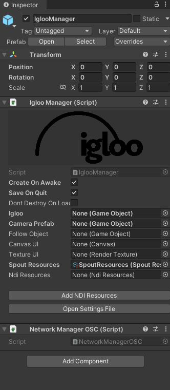

# Template Project for Immersive Spatial Augmented Reality (SAR) System with Body Tracking

This Unity project provides a **template setup** for developing applications that integrate **Immersive Spatial Augmented Reality (SAR) System** using a 7-meter IglooVision cylinder and **body tracking** powered by **ZED 2i cameras** at Texas A&M University.

It serves as a base for building your own immersive projects that utilize both panoramic projection and body tracking, either within an existing Igloo setup or through custom configurations.

---

## Hardware Overview

### Igloo Cylinder

A 7-meter 360° panoramic projection cylinder by IglooVision.
**More info:** [https://www.igloovision.com/products/cylinders-cubes-domes](images/https://www.igloovision.com/products/cylinders-cubes-domes)

### ZED 2i Cameras

StereoLabs ZED 2i cameras provide real-time depth and body tracking capabilities.
**More info:** [https://www.stereolabs.com/store/products/zed-2i](images/https://www.stereolabs.com/store/products/zed-2i)

---

## Example Demo Overview

The included **demo scene** tracks users' body movements so that **raising hands** triggers **visual splashes** on the cylindrical walls and plays **musical notes** as feedback.
The system supports **multiple users**, with each user’s splashes displayed in a unique color.

---

## Setup Instructions

### 1. Calibrate the ZED System (Optional)

In case you want to re-calibrate the ZED system due to repositioning of the ZED cameras, follow the following steps. This step is optional as if you are using the System at Texas A&M University, then the cameras are already calibrated to work inside the Igloo Cylinder. 

1. Open **ZED360**.
2. Click **Setup your room**.

3. Select **Auto Discover**.

4. Ensure the camera list matches your physical setup (Existing setup has 3 cameras).

5. Click **Setup your room**.

6. Start **Calibration**.

7. Move naturally inside the cylinder to allow cameras to detect body motion. This step may take a while 10-15 minutes.
   * Ensure the room is **well lit** during calibration.
8. Click **Finish Calibration**.

9. Save the resulting **calibration JSON file** in a convenient location. You may use this to run ZED Livelink Fusion as we did in Step 1.


---

### 2. Run Calibrated ZED Fusion

Before running the Unity scene, start the **ZED Unity Livelink Fusion** using your calibration file.

For example, in our system:

```powershell
PS C:\Users\softi> cd C:\Users\softi\Downloads\zedfusion\zed-unity-livelink\zed-unity-livelink-fusion\build\Release
PS C:\Users\softi> ./ZED_Unity_Livelink_Fusion.exe C:\Users\softi\Documents\zed-calibration\zed_calibration.json
```

You should see message saying that all cameras in the system are "Ready", followed by a tracked space where you can see tracked skeletons:


**Detailed setup guide:**
Detailed instructions for setting up zed live link fusion from scratch can be found below. In the current setup, version `v4.2.0` is being used.
[https://github.com/stereolabs/zed-unity-livelink?tab=readme-ov-file#using-the-live-link-for-unity-tools](images/https://github.com/stereolabs/zed-unity-livelink?tab=readme-ov-file#using-the-live-link-for-unity-tools)

---

### 3. Run the Splash Demo Scene

Open and run the **Splash Demo Scene** in Unity.

#### Main Components

* **IglooManager:**
  Configures the Igloo system, projection cameras, and streaming options.
  Supports **Spout** and **NDI** streaming for external projection.

* **FusionManager:**
  Manages body tracking.

  * Contains the port for ZED Fusion stream.
  * Allows switching **tracking mode**, **avatar type**, and **body tracking parameters**.

* **Custom Components:**
  Handle splash spawning and interaction logic based on user movements.

---

### 4. Interaction Behavior

* When users **raise their arms**, splashes appear on the panoramic wall.
* Each user receives a **unique splash color**.
* Musical notes are triggered depending on hand height and horizontal position:

  * Imagine **piano keys laid vertically**, divided into **three horizontal zones** around the cylinder.
  * Higher hand positions trigger higher-pitched notes.

---

### 5. Output & Streaming Options

After running the demo scene, the Unity output can be streamed via **NDI** or **Spout**.

#### Previewing Spout Output

Use the **IglooPreview** tool to preview Spout streams.


#### Streaming via NDI
We currently use NDI to stream from Unity on the host computer to the client computer connected to Igloo System.

1. Open **OBS Studio** on the host computer.
2. Navigate to **Tools → NDI Output Settings**.

3. Enable both **Main Output** and **Preview Output**.


On the **client computer** (connected to the Igloo Projection System):

1. Open **Igloo Core Engine**.
2. Option 1: Choose an existing session (*IPS-1*, configured for the demo implementaiton)


3. Option 2: Create a new session
   * **Session → New Session**
3. Add NDI input:
   * **+ → New Content → Capture → NDI**

4. In the **NDI panel**, select the appropriate stream from the host (for default, select, `VENGEANCE (Unity)`).

5. In the **Geometry** tab to adjust the viewport if necessary.

---
You should now be able to step inside Igloo and see it working.
---

## Notes

* The number of users that can be tracked simultaneously depends on the machine’s **computational power**.
* Ensure that **lighting conditions** are optimal for ZED cameras to maintain accurate body tracking.
* Calibration accuracy impacts tracking stability.

---

## References

* **Igloo Cylinder:** [https://www.igloovision.com/products/cylinders-cubes-domes](https://www.igloovision.com/products/cylinders-cubes-domes)
* **ZED 2i Camera:** [https://www.stereolabs.com/store/products/zed-2i](https://www.stereolabs.com/store/products/zed-2i)
* **ZED SDK (version used: 5.0.0):**: [https://www.stereolabs.com/developers/release](https://www.stereolabs.com/developers/release)
* **ZED Unity Livelink Fusion Setup (version used: 4.2.0):** [https://github.com/stereolabs/zed-unity-livelink](https://github.com/stereolabs/zed-unity-livelink/tree/v4.2.0)
* **Igloo Unity Setup Docs (version used: 1.3):** [https://360igloo.atlassian.net/wiki/spaces/IG/pages/3272867841/v1.3+Installation+Instructions](https://360igloo.atlassian.net/wiki/spaces/IG/pages/3272867841/v1.3+Installation+Instructions)

